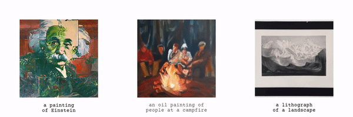

# Visual Anagrams | Factorized Diffusion

**NOTE:** This repo contains code for both [Visual Anagrams](https://dangeng.github.io/visual_anagrams/) and [Factorized Diffusion](https://dangeng.github.io/factorized_diffusion/). 

**Please see [this readme](https://github.com/dangeng/visual_anagrams/blob/main/readme_factorized_diffusion.md) for info about factorized diffusion.**

# Visual Anagrams: Generating Multi-View Optical Illusions with Diffusion Models

CVPR 2024 (Oral)

[Daniel Geng](https://dangeng.github.io/), [Aaron Park](https://inbumpark.github.io/), [Andrew Owens](https://andrewowens.com/)

## [[Arxiv](https://arxiv.org/abs/2311.17919)] [[Website](https://dangeng.github.io/visual_anagrams/)] [[Colab (Free Tier)](https://colab.research.google.com/github/dangeng/visual_anagrams/blob/main/notebooks/colab_demo_free_tier.ipynb)] [[Colab (Pro Tier)](https://colab.research.google.com/github/dangeng/visual_anagrams/blob/main/notebooks/colab_demo_pro_tier.ipynb)]

[](https://colab.research.google.com/github/dangeng/visual_anagrams/blob/main/notebooks/colab_demo_free_tier.ipynb) <sub>(Free Tier)</sub>

[](https://colab.research.google.com/github/dangeng/visual_anagrams/blob/main/notebooks/colab_demo_pro_tier.ipynb) <sub>(Colab Pro)</sub>



This repo contains code to generate visual anagrams and other multi-view optical illusions. These are images that change appearance or identity when transformed, such as by a rotation, a color inversion, or a jigsaw rearrangement. Please read our paper or visit our website for more details.

## Colab Demos

We provide two colab demos. One was graciously written by [Tamizh N](https://github.com/tmzh), and is memory efficient enough to be run with Colab Free Tier resources (at the cost of just slightly more inconvenience):

[](https://colab.research.google.com/github/dangeng/visual_anagrams/blob/main/notebooks/colab_demo_free_tier.ipynb) <sub>(Free Tier)</sub>

For people with, or willing to obtain, a Colab Pro subscription we also have the following notebook, which requires a High RAM and V100 runtime, but is slightly more convenient to use:

[](https://colab.research.google.com/github/dangeng/visual_anagrams/blob/main/notebooks/colab_demo_pro_tier.ipynb) <sub>(Colab Pro)</sub>

## Installation

### Conda Environment

Create a conda env by running (only on Linux):

```
conda env create -f environment.yml
```

and then activate it by running 

```
conda activate visual_anagrams
```

### DeepFloyd

Our method uses [DeepFloyd IF](https://huggingface.co/docs/diffusers/api/pipelines/deepfloyd_if), a pixel-based diffusion model. We do not use Stable Diffusion because latent diffusion models cause artifacts in illusions (see our paper for more details).

Before using DeepFloyd IF, you must accept its usage conditions. To do so:

1. Make sure to have a [Hugging Face account](https://huggingface.co/join) and be logged in.
2. Accept the license on the model card of [DeepFloyd/IF-I-XL-v1.0](https://huggingface.co/DeepFloyd/IF-I-XL-v1.0). Accepting the license on the stage I model card will auto accept for the other IF models.
3. Log in locally by running

```
python huggingface_login.py
```

and entering your [Hugging Face Hub access token](https://huggingface.co/docs/hub/security-tokens#what-are-user-access-tokens) when prompted. It does not matter how you answer the `Add token as git credential? (Y/n)` question.


## Usage


To generate 90 degree rotation illusions we can use the below command. This will create 10 samples, at 3 different sizes: 64×64, 256×256, and 1024×1024. See below for commands to generate more types of multi-view illusions.

```
python generate.py --name rotate_cw.village.horse --prompts "a snowy mountain village" "a horse" --style "an oil painting of" --views identity rotate_cw --num_samples 10 --num_inference_steps 30 --guidance_scale 10.0 --generate_1024
```

Here is a description of useful arguments:

- `--name`: Name for the illusion. Will save samples to `./results/{name}`.
- `--prompts`: A list of prompts for illusions
- `--style`: Optional style prompt to prepend to each of the prompts. For example, could be `"an oil painting of"`. Saves some writing.
- `--views`: A list of views to use. Must match the number of prompts. For a list of views see the `get_views` function in `visual_anagrams/views/__init__.py`.
- `--num_samples`: Number of illusions to sample
- `--num_inference_steps`: Number of diffusion denoising steps to take.
- `--guidance_scale`: Guidance scale for classifier free guidance.
- `--generate_1024`: Use DeepFloyd Stage III (which is just Stable Diffusion 4x Upscaler) to upsample to 1024x1024 image.

### Upscaling

We use the first two stages of DeepFloyd IF to generate a 64×64 and 256×256 multi-view illusion. DeepFloyd further uses the [Stable Diffusion x4 Upscaler](https://huggingface.co/stabilityai/stable-diffusion-x4-upscaler) to go from 256×256 to 1024×1024. However, this model uses latents and we therefore did not or cannot implement multi-view denoising for this stage. So we can only naively upsample, using just the first prompt. Its important to not that this may affect the quality of transformed images, but in practice we find that it works quite well.

### Animating

To animate the above two view illusion, we can run the below command. This command should work for all three sizes at which we sample (64×64, 256×256, and 1024x1024), although honestly 64×64 is very small and looks quite bad.

```
python animate.py --im_path results/rotate_cw.village.horse/0000/sample_1024.png --metadata_path results/rotate_cw.village.horse/metadata.pkl
```

Here is a description of useful arguments:

- `im_path`: The path to your illusion. This should work for any of the three image sizes (64, 256, or 1024).
- `metadata_path`: The path to metadata about the views and prompts used to generate the illusion, which is saved by `generate.py`. Overrides the options below.
- `view`: Name of the view. For a list of views see the `get_views` function in `visual_anagrams/views/__init__.py`
- `prompt_1`: Prompt for the original image. You can add `\n` characters here for line breaks.
- `prompt_2`: Same as `prompt_1`, but for the transformed image.

## The Art of Choosing Prompts

Choosing prompts for illusions can be fairly tricky and unintuitive. Here are some tips:

- Intuition and reasoning works less often than you would expect. Prompts that you think would work great often work poorly, and vice versa. So exploration is key.
- Styles such as `"a photo of"` tend to be harder as the constraint of realism is fairly difficult (but this doesn't mean they can't work!).
- Conversely, styles such as `"an oil painting of"` seem to do better because there's more freedom to how it can be depicted and interpreted.
- In a similar vein, subjects that allow for high degrees of flexibility in depiction tend to be good. For example, prompts such as `"houseplants"` or `"wine and cheese"` or `"a kitchen"`
- But be careful the subject is still easily recognizable. Illusions are much better when they are instantly understandable.
- Faces often make for very good "hidden" subjects. This is probably because the human visual system is particularly adept at picking out faces. For example, `"an old man"` or `"marilyn monroe"` tend to be good subjects.
- Perhaps a bit evident, but 3 view and 4 view illusions are considerably more difficult to get to work.

## More Examples

Flipping illusion:

```
python generate.py --name flip.campfire.man --prompts "an oil painting of people around a campfire" "an oil painting of an old man" --views identity flip --num_samples 10 --num_inference_steps 30 --guidance_scale 10.0 --generate_1024
```

Jigsaw illusions:

```
python generate.py --name jigsaw.houseplants.marilyn --prompts "houseplants" "marilyn monroe" --style "an oil painting of" --views identity jigsaw --num_samples 10 --num_inference_steps 30 --guidance_scale 10.0 --generate_1024
```

Inner circle illusions:

```
python generate.py --name inner.einstein.marilyn --prompts "albert einstein" "marilyn monroe" --style "an oil painting of" --views identity inner_circle --num_samples 10 --num_inference_steps 30 --guidance_scale 10.0 --generate_1024
```

Color inversion illusions:

```
python generate.py --name negate.landscape.houseplants --prompts "a landscape" "houseplants" --style "a lithograph of" --views identity negate --num_samples 10 --num_inference_steps 30 --guidance_scale 10.0 --generate_1024
```

Patch permutation illusions:

```
python generate.py --name patch.lemur.kangaroo --prompts "a lemur" "a kangaroo" --style "a pencil sketch of" --views identity patch_permute --num_samples 10 --num_inference_steps 30 --guidance_scale 10.0 --generate_1024
```

Pixel permutation illusions:

```
python generate.py --name pixel.duck.rabbit --prompts "a duck" "a rabbit" --style "a mosaic of" --views identity pixel_permute --num_samples 10 --num_inference_steps 30 --guidance_scale 10.0 --generate_1024
```

Skew illusions:

```
python generate.py --name skew.tudor.skull --prompts "a tudor portrait" "a skull" --style "an oil painting of" --views identity skew --num_samples 10 --num_inference_steps 30 --guidance_scale 10.0 --generate_1024
```

Three view illusions:

```
python generate.py --name threeview.waterfall.teddy.rabbit --prompts "a waterfall" "a teddy bear" "a rabbit" --style "an oil painting of" --views identity rotate_cw rotate_ccw --num_samples 10 --num_inference_steps 30 --guidance_scale 10.0 --generate_1024
```

"Square Hinge" illusions:

```
python generate.py --name hinge.duck.rabbit --prompts "a duck" "a rabbit" --style "a water color of" --views identity square_hinge --num_samples 10 --num_inference_steps 30 --guidance_scale 10.0 --generate_1024
```

## Failure Views

We also implement views which fail, as discussed in our paper. These include:

- `InnerCircleViewFailure`: Inner circle rotation with bilinear or nearest interpolation.
- `BlurViewFailure`: Blurring, in an attempt to make hybrid images.
- `WhiteBalanceViewFailure`: Very simple white balancing, in an attempt to recreate the "dress" illusion

All of the above views fail because they change the statistics of the Gaussian noise. See paper for more details.

## Custom Views

Views are derived from the base class `BaseView`. You can see many examples of these transformations in `views.py`, if you want to write your own view.

Additionally, if your view can be implemented as a permutation of pixels, you can probably get away with just saving a permutation array to disk and pasing it to the `PermuteView` class. See `permutations/make_inner_rotation_perm.py` and `get_view()` in `views.py` for an example of this.
